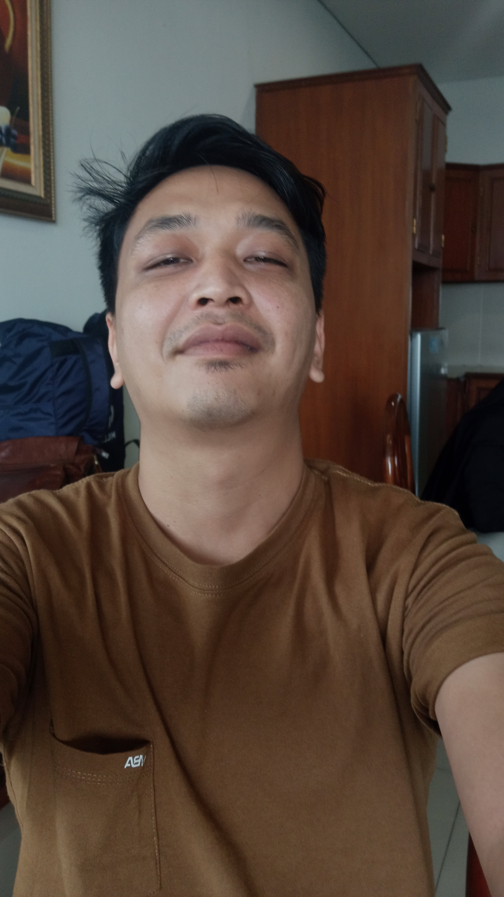

# 🌐 Ari Ginanjar - Web Portofolio

Halo! Saya **Ari Ginanjar**, seorang calon web developer yang sedang belajar HTML dan CSS. Ini adalah proyek portofolio sederhana saya yang dibuat sebagai latihan dasar dalam membangun tampilan halaman web pribadi.

## ✨ Fitur

- Responsive Design (Mobile Friendly)
- Informasi tentang saya
- Daftar keahlian (HTML, CSS, Flexbox)
- Daftar proyek yang sedang atau sudah dikerjakan
- Informasi kontak dan sosial media

## 🛠️ Teknologi

- HTML5
- CSS3 (Media Queries, Styling)
- VS Code (sebagai code editor)

## 📸 Preview

 <!-- Ganti dengan screenshot halaman kalau ada -->

## 🔗 Live Demo

📍 [Kunjungi Website Saya di GitHub Pages](https://ariginanjar.github.io/portofolio/)  
*(Link akan aktif setelah kamu upload dan aktifkan GitHub Pages)*

## 📬 Kontak

- 📧 Email: ariginanjar@email.com  
- 📱 WhatsApp: 082111586147  
- 🌐 [Instagram](https://instagram.com/ariginanjar)  
- 👨‍💻 [GitHub](https://github.com/ariginanjar)

## 📝 Catatan

Proyek ini adalah bagian dari proses belajar saya menjadi Front-End Web Developer.  
Masih banyak yang perlu dikembangkan dan ditingkatkan ke depannya 💪

---

> Dibuat dengan semangat dan cinta akan belajar. 😎  
> © 2025 Ari Bono
